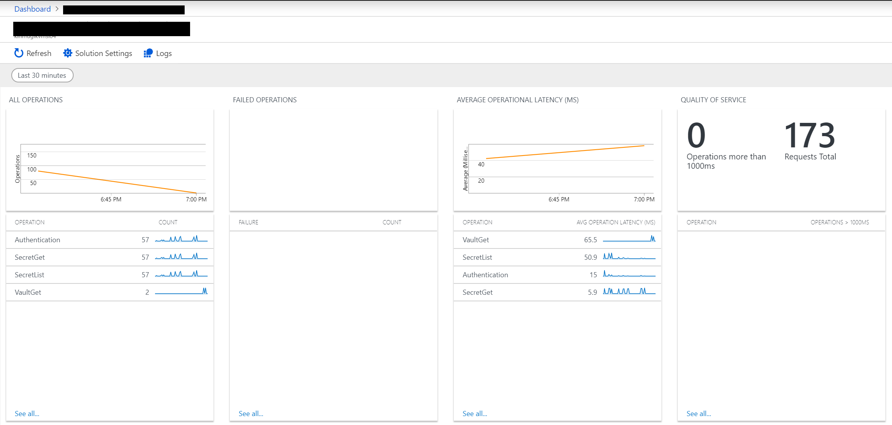
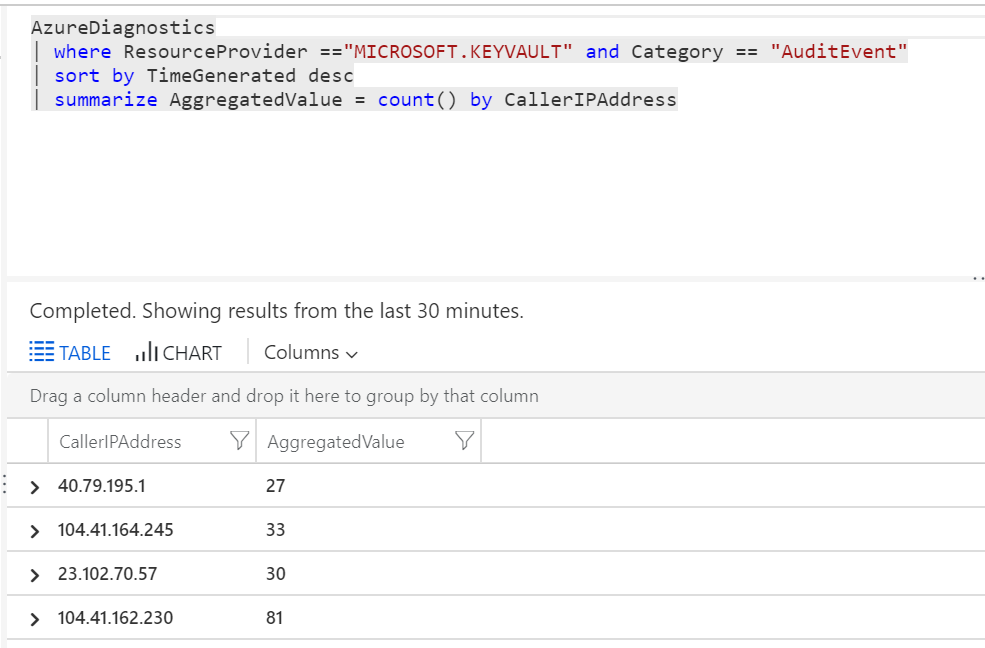
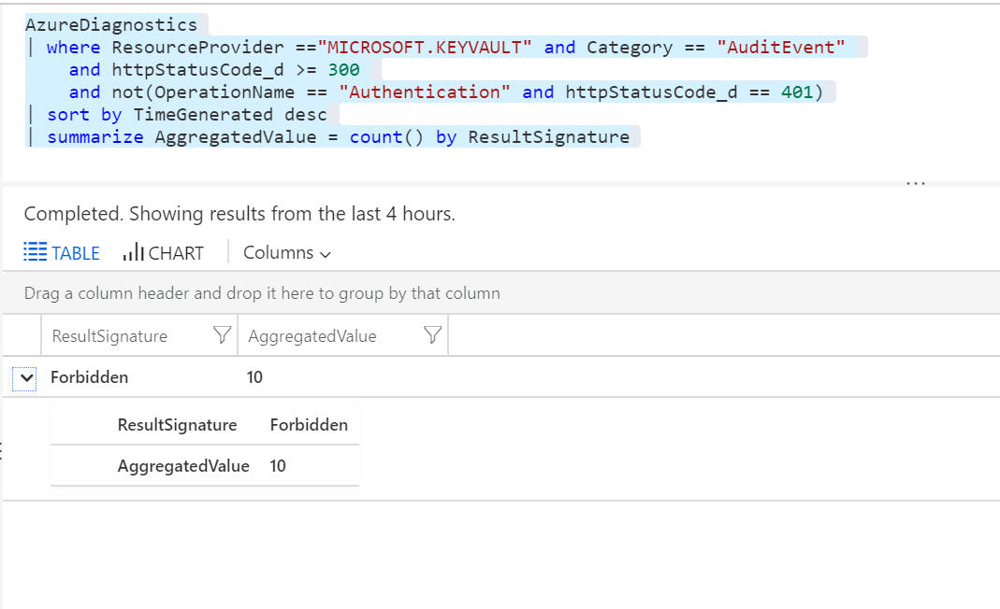
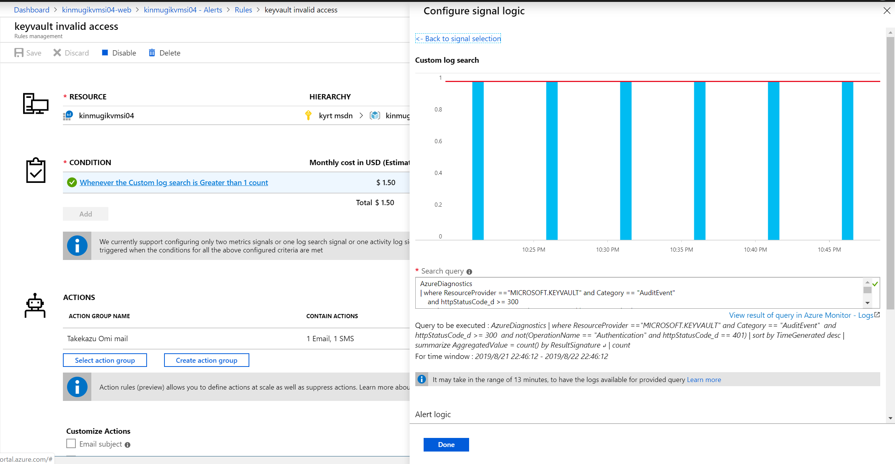

## はじめに

本稿では、アプリケーションの構成情報は、概念的に下記の３つにわけて設計することを勧めています。

1. 環境非依存なアプリケーション構成情報
2. 環境依存のアプリケーション構成情報
3. センシティブ情報

１は、アプリケーションに固有の情報で通常ローカルファイルを使います。２の環境依存の設定は、アプリケーションと切り離しで別のリソース(App Settings、App Configuration)で扱います。3のセンシティブ情報に関しては監査ログが必要な場合はKey Vault必須となります。監査ログが要件上必須でない場合も、Key Vaultの利用は全体的なセキュリティレベルを上げるのでお薦めします。Key Vaultを使う場合は、センシティブ情報だけをKey Vaultに保存し、Key Vaultには適切なアクセス権を設定して、監査ログを有効してください。このように構成情報を３つに分けて、センシティブ情報をKey Vaultに保存するのが本稿のベストプラクティスです。

本稿では、アプリケーションで使われるセンシティブ情報(パスワード等)の保護のベストプラクティスについて書いています。以降では、アプリケーションの設定情報を外部に保持する複数の方法について比較し、その後センシティブ情報をKey Vaultに保存する利点を論じています。

### 方式比較

設定情報を外部に保つ方法として、ローカルファイル(Web.config/appsettins.json)、App Service のApp Settings, App Configuration, Key Vault, Storage Blobの５つを比較しました。後者４つはAzure 固有の機能ですが、同等のものは各種クラウド環境に存在します。

ここでは下記の点を比較のポイントとしました。

- 暗号化の有無：情報が暗号化して保存されるか
- アクセス制御：アプリのデプロイ等の権限と別に認証とアクセス制御に対応しているか
- 監査ログ：read/write/delete/create のログ保存
- 共有：複数のインスタンス、アプリケーションからアクセスの可否
- 変更管理：バージョン管理、もしくはスナップショットのサポート
- 変更通知：変更を通知で受け取れるか

|方式|暗号化|ACL|監査ログ|共有|変更管理|変更通知|備考|
|---|----|----|----|----|----|----|----|
|ローカルファイル|✕|✕|✕|✕|✕|✕|※1|
|App Settings|◯|✕|✕|△|✕|△|※2|
|App Configuration|◯|◯|✕|◯|◯|◯|※3|
|Key Vault|◯|◯|◯|◯|◯|✕||
|Storage Blob|◯|△|✕|◯|✕|✕|※4|

- ※1 管理はSCMで実施。App Serviceではaspnet_regiis.exeによる暗号化は利用できず。独自実装が必要
- ※2 共有は、Web Apps/Web Job/Functions等で同一Website内のみ。変更した場合はサイトが再起動される
- ※3 ACLはrw/roのアクセスキー、あるいはAADとRBACで制限可能
- ※4 独自実装で作れば全て可能だが、本稿ではBlobの機能のみで扱う

これを見ると、App ConfigurationとKey Vaultの間の差は、監査ログと変更通知だけで、あまり機能面で大きな差が無いことがわかります。

### 選択フロー

どのような場合に、どの方法を使うのかを簡単なフローにしました。参考にしてください。６が一番重要な選択肢です、事前に[リスク分析](https://ja.wikipedia.org/wiki/%E6%83%85%E5%A0%B1%E3%82%BB%E3%82%AD%E3%83%A5%E3%83%AA%E3%83%86%E3%82%A3%E3%83%9E%E3%83%8D%E3%82%B8%E3%83%A1%E3%83%B3%E3%83%88%E3%82%B7%E3%82%B9%E3%83%86%E3%83%A0#%E3%83%AA%E3%82%B9%E3%82%AF%E5%88%86%E6%9E%90%E6%96%B9%E6%B3%95)を行いましょう。

1. アプリケーションが従うべき、コンプライアンス、ガバナンスがありますか
    - Yes -> 2.
    - No -> 5.
2. コンプライアンス、ガバナンスで機密情報が定義されていますか
    - Yes -> 3.
    - No -> 5.
3. 開発運用で機密情報を扱う場合に、特別なコントロール（NDA、物理セキュリティ等）を要求されていますか
    - Yes -> 4.
    - No -> 6.
4. 分離すると、機密情報を扱うケース（人員）が減らせます。さらに監査ログが取れるので、Key Vaultがお勧めです
5. 個人情報を扱いますか。個人情報保護法、GDPRを忘れないでください
    - Yes -> 2.
    - No -> 7.
6. 漏洩時のビジネスインパクトとKey Vaultの追加コストを比較すると、追加コストが大きいですか
    - Yes -> 7.
    - No -> 4.
7. 複数アプリで共有したいなら、App Configuration、App Service等で必要無ければ、App Settins がお勧めです


## センシティブ情報の保護にKey Vaultを使う

アプリケーションにはパスワード(SQL Database等)、アクセスキー（Storge、Redis等）など様々なセンシティブ情報(Sensitive Information)があります。これらは、開発、本番など環境によって異なったものが使われ、ソースコードと別に管理される必要があります。この情報の漏洩は、データベースなど保護対象の機密情報（個人情報やクレジットカード情報等）が保存されたデータストアからの機密情報の漏洩に繋がる危険性があります。

情報漏洩は、相変わらずセキュリティインシデントの上位にあります。[OWASP Top 10-2017/A3-Sensitive Data Exposure](https://www.owasp.org/index.php/Top_10-2017_A3-Sensitive_Data_Exposure) OWASP Cheat Sheet の、.NET securityでは、防衛方法として設定ファイルの暗号化が推薦されています。

- OWASP Cheat Sheet の、.NET securityから

    > Encrypt sensitive parts of the web.config using aspnet_regiis -pe (command line help)).
[OWASP Cheat Sheet/.NET security](https://cheatsheetseries.owasp.org/cheatsheets/DotNet_Security_Cheat_Sheet.html#general)

- Common Weakness Enumeration (CWE) から
    - [CWE-13: ASP.NET Misconfiguration: Password in Configuration File](https://cwe.mitre.org/data/definitions/13.html)
    - [CWE-260: Password in Configuration File](https://cwe.mitre.org/data/definitions/260.html)
    - [CWE-312: Cleartext Storage of Sensitive Information](https://cwe.mitre.org/data/definitions/312.html)

しかしながら、上記の方法は古い方法と言わざる得ません、我々は、セキュリティを高めるために、センシティブ情報は分離して、Key Vault に入れることを推薦します。OWASPやCWEの推薦事項のように、Configの一部を暗号化する方法。[Encrypting Configuration File Sections Using Protected Configuration](https://docs.microsoft.com/en-us/dotnet/framework/data/adonet/connection-strings-and-configuration-files#encrypting-configuration-file-sections-using-protected-configuration) や、App Setting に入れる方法より優れていて、導入もそれほど難しくありません。

導入で少し敷居が高い部分は、Azure ADを使ったアクセス管理の部分ですが、一旦理解してしまえば、それほど高い敷居というわけではありません。少しのコストで大きな効果があり、Key Vault はとても良いものと言えます。

本稿では、以下の視点でなぜKey Vaultが重要か、どのような使い方がベストプラクティスなのかを段階を追って説明していきます。

1. 分離：アプリケーションとセンシティブ情報は分離する
2. 暗号化：センシティブ情報は暗号化して保存する
3. アクセス管理：センシティブ情報のアクセスは制限する
4. 監査：センシティブ情報のアクセスを監査する

## 分離

ここからは、現在まで使われてきた実装を振り返りながら、分離の必要性、分ける基準、Key Vault の意味を考えていきます。Key Vaultには、鍵、証明書、シークレット、ストレージアカウントを扱う機能がありますが、ここでは話を単純化するためシークレットを前提に話をします。鍵、証明書をKey Vaultで扱うことでより高度なデータの保護が実装できますが、それは本稿の範囲外とします。実装は、.NET Framework/Core 前提ですが、他の言語でも似たような機能が用意されています。

### アプリケーションと設定ファイル(Configuration)の分離

以前より、環境依存設定はソースファイルに直接記述せずに、外部の設定ファイルに記述し実行時に読み込むのが良いとされて来ました。例えば、データベースを使う場合のホスト名、データーベース名、Redis ホスト名等は、開発環境と本番環境で違います。これらの、環境依存の設定情報はハードコードせずにローカルファイルの設定ファイルに記述します。（残念ながら、未だにソースコードにハードコードされてる場合があるようですが）

アプリケーションと設定ファイルで分離されていれば、デプロイの際に設定ファルを切り替えて、開発環境では「アプリケーション＋開発用の設定ファイル」、本番環境では「アプリケーション＋本番用の設定ファイル」とすることで、必要なものがデプロイできます。分離の利点は数多くありますが、特に重要と考えるのは、「環境毎にアプリケーション本体を修正する必要が無い、ソースコード管理からセンシティブ情報情報を除外できる、アプリケーションバイナリを解析してセンシティブ情報を抜き出される危険性が無い」などの点です。この方法では、デプロイ後の設定ファイルはインスタンス内のインターネット非公開の場所に配置されることで保護されます。

ローカルファイル方式の特徴でもあり問題でもある点は、アプリケーションと設定ファイルが纏めてデプロイされることです。そのため、デプロイ（もしくは、パッケージの作成者）は、本番用の設定ファイルを参照することができ、同時にセンシティブ情報も参照することが可能となります。（これを避けるためには、設定ファイルの一部を暗号化するなどの方法が取られます、上記 OWASP Chatsheet参照）

この状態だとデプロイを自動化しても、CI/CDの設定をする時や、CI/CDでエラーになったときの調査でセンシティブ情報を見ることが出来てしまいます。CI/CDについては、参照、[Azure DevOps Projects を使用して既存のコードの CI/CD パイプラインを作成する](https://docs.microsoft.com/en-us/azure/devops-project/azure-devops-project-github)

<figure id="config01">

<figcaption>図１ アプリケーションと設定ファイルの関係</figcaption>
</figure>

設定ファイルの中には、アプリケーションを構成の補助情報、環境依存情報、センシティブ情報などが一体となって書かれていて、それが運用時にアクセス可能な状態になるというわけです。ここでは、アプリのデプロイと設定のデプロイが１つになっています。

### App Service の App Settings

より進んだ方法として、[Azure App Service](https://docs.microsoft.com/en-in/azure/app-service/overview)では、[App Settings](https://docs.microsoft.com/en-us/azure/app-service/configure-common) が用意されています。App Settingsでは、Azure Portal や、API経由 (例：[Web Apps - Get Configuration](https://docs.microsoft.com/en-us/rest/api/appservice/webapps/getconfiguration))で設定が行われ、設定内容はアプリケーション内から環境変数として参照できます。この仕組を使うと、アプリケーションのデプロイと設定を別々に行うことができるというのが大きな違いです。これは、The Twelve Factors. の [III. Config Store/config in the environment](https://12factor.net/config) でもベストプラクティスに入っている考え方です。


こうすると、本番や開発などの別々のWeb Siteに「App Settingsに環境固有の設定をする」、「アプリケーションをデプロイする」の２つの手順に分け、設定とデプロイを別にすることができます。また、App Settings の別の利点として、サービスが複数のインスタンスにスケールした時にも設定を一箇所で管理できるという点があります。これは、従来のシステムで要件して重要視されることは（あまり）ありませんでしたが、クラウドの利点を活かすためには重要な要件です。このようにアプリケーションと設定を分離し共有する方法は、[External Configuration Store pattern](https://docs.microsoft.com/en-us/azure/architecture/patterns/external-configuration-store) として知られています。

App Settings のような方法は、「アプリケーション＋設定ファイル」で一つのパッケージとして扱うよりも格段に優れた方法（特にクラウド環境では）ですが、セキュリティーという面では、設定にセンシティブなものとそうでないものの区別が無く、設定のどこ項目を誰が見れるかなどの設定ができないという点で不十分です。この区別が無いために、設定を確認できる人＝センシティブ情報にアクセス出来る人となってしまいます。セキュリティー面から言うと、センシティブ情報にアクセスできる人は少ないほど良い（運用難易度が低い）と言えるので、この点は良くありません。

{}
**センシティブ情報にアクセスできる人は少ないほど良い**

例えば、PCI DSS 3.2.1 要件 3.6.5 に下記のようにあります。

{}
> 「平文暗号化鍵の知識を持つ従業員が離職したなど、」鍵の整合性が脆弱になっている場合、または鍵が侵害された疑いがある場合に必要な、鍵の破棄または取り替えを
{}

ここでは、平文暗号化鍵と記述されていますが、センシティブ情報に全般に該当すると考えて良いでしょう。センシティブ情報にアクセスできる人が少なければ少ないほど、現実的な運用が可能となりセキュリティーリスクが軽減されると言えます。
{}

リソース操作に、「Microsoft.Web/sites/config」に、「Read, Write, delete, snapshots/read, list/Action」が有ありますが、これを許可しない(NotAction)場合、App Settings 全体の操作に影響します。これだと少々粒度が荒く使い辛い。つまり、App Services と App Settingsの組み合わせだけでは、環境依存設定とセンシティブ情報の分離が不十分です。

※ その他の、RBACで設定可能な、App Settingsの操作は、[Microsoft.Web/sites/config/*](https://docs.microsoft.com/en-us/azure/role-based-access-control/resource-provider-operations#microsoftweb) を見てください。


### Azure App Configuration の利用

リソースとして構成情報を持つもう１つの新しい方法として、[Azure App Configuration (preview)](https://docs.microsoft.com/en-us/azure/azure-app-configuration/) があります。App Settingsでは、同一のWeb Site内でしか設定情報は共有出来ません。例えば、複数のWeb Siteから構成されたサービスや、Azure Batchなど別のリソースとは設定の共有することができません。Azure App Configuration は独立したリソースで異なったリソーから利用することができます。さらに、App Configuration には、設定ストアとしての豊富な機能の他、[Managed identities for Azure resources(MSI)](https://docs.microsoft.com/en-us/azure/azure-app-configuration/howto-integrate-azure-managed-service-identity)との統合、[保管中または転送中の完全なデータ暗号化](https://docs.microsoft.com/en-us/azure/azure-app-configuration/overview#why-use-app-configuration) が含まれておりApp Settigsより優れています。（previewですが）

App Settingsと違って、App Configrationは１つのアプリケーションで複数のApp Configrationを利用することができます。その機能とRBACを使って、センシティブ情報を入れるApp Configrationを別に設ける方法が考えられます。その場合、アクセスキーを使ったアクセス制御ではアクセスキーをどのように保護するかという問題が発生するので、MSI、あるいはService Principalを使ったアクセスをする必要があります。MSIでは、Service Principalのシークレット暴露の問題は無いのですが、１つのService Principalしか持てないという問題があります。つまり、センシティブ情報の有無で２つのApp Configrationを作成してもMSI経由で２つを切り分けけてアクセスすることはできません。MSIを使わずに、自前でService Principal を使う場合は、証明書認証を使うことで複数のApp Configrationを使い分けることができますが、その証明書を保護する必要があります。App Configrationだけでは証明書を保護することはできず保護にはKey Vaultが必要です。ローカルに証明書を持っておいて、デプロイ時にApp Service等に登録することは可能ですが、結局ローカルでどう管理するかという問題が残ってしまいます。結局、App Configrationにセンシティブ情報を入れた場合、環境依存設定とセンシティブ情報の分離が不十分になってしまいます。この点については、App Settingsと同じような限界があると言えます。

### Azure Key Vault を使う

更に進めてセキュリティ面を考慮した場合、センシティブ情報の保存には、Key Vault を使う方法を推薦します。下図のようにすることで、アプリケーションの開発運用担当と、センシティブ情報を扱うセキュリティー担当をわけることができます。これは、App Service + App Settings | App Configuration では出来なかったことで、センシティブ情報を知る範囲を狭めるという意味で非常に効果的です。これによって、アプリケーションの開発運用チームはセンシティブ情報を扱わなくなり、チームに要求されるセキュリティー上の負担を軽減できます。これが、センシティブ情報情報の局所化によってもたらされる利点です。


{}
**チームに要求されるセキュリティー上の負担**
非現実的な情報セキュリティ関連誓約書、セキュリティルームでのオペレーションなどをゼロにはできなくても、範囲を小さくできる、という話がある。
{}

アプリケーションから Key Vault へのアクセスは、設定情報に、専用のService Principalを用意して自前でアクセス経路を用意するか、**Azure リソースのマネージド ID** ([Azure リソースのマネージド ID とは?](https://docs.microsoft.com/ja-jp/azure/active-directory/managed-identities-azure-resources/overview), 以下MSI)を使います。App Service では、MSIを使うのがベストプラクティスです。だたし、現時点では、すべてのAzure リソースがMSIに対応しているわけではないので注意が必要です。[Services that support managed identities for Azure resources](https://docs.microsoft.com/en-us/azure/active-directory/managed-identities-azure-resources/services-support-managed-identities)
MSI 非対応リソースでは、Service Principalを使って、リソースとKey Vaultの紐付をする必要があります。（これに付いては別途）

### MSIを使ったKey Vaultへのアクセス

簡単に、**Azure リソースのマネージド ID (MSI)**  を使った、App SericesからのKeyVaultの利用を説明します。細部を省略して言うと、MSIは、Azureのリソースに専用のAzure ADのService Principalを作成し、他のリソースでは、そのサービスプリンシパルからのアクセスを許可することで、リソース間の信頼関係を作成する機能です。Service Principalの作成は自動的に行われ、Service PrincipalのクレデンシャルはAzure側で管理されるため非常に扱いやすい仕組みになっています。MSIを使うことで、アプリケーションからは、簡単に自身のリソースに紐付いたService Principalのトークンを取得でき、それを使って、許可されたリソースを呼ぶことができます。MSI以前では、Azure ADあるいは、リソースへのアクセスは、パスワードやアカウントキーで制御されていました。MSIには、システム割当のマネージドIDとユーザー割当のマネージドIDがありますが、ここではシステム割当のマネージドIDを説明します。（現状、ユーザー割当の方は、Key Vault 側がサポートしていません）

Azure Portal、Azure CLI、PowerShell、ARM template などいろいろな方法で設定できますか。再現性が高いので、ここでは、ARM template を使って手順を説明します。利用方法の詳細は、[App Service と Azure Functions でマネージド ID を使用する方法](https://docs.microsoft.com/ja-jp/azure/app-service/overview-managed-identity) を参照してください。

非常に簡単に利用することがわかるように、実際の構築コードを交えながら説明していきます。サンプルコード一式は、[ここ](https://github.com/takekazuomi/keyvault-msi-sample) にあります。

Web Appsの作成時に、identity プロパティに、**type": "SystemAssigned"** を指定すると、このリソースにシステム割当のマネージドIDが作成されます。

```json
{
    "type": "Microsoft.Web/sites",
    "apiVersion": "2016-08-01",
    "name": "[parameters('webSiteName')]",
    "location": "[resourceGroup().location]",
    "identity": {
        "type": "SystemAssigned"
    },
    "dependsOn": [
        "[variables('hostingPlanName')]"
    ],
    "tags": {
        "usage": "kvmsi"
    },
    "properties": {
        "name": "[parameters('webSiteName')]",
        "serverFarmId": "[resourceId('Microsoft.Web/serverfarms', variables('hostingPlanName'))]",
        "siteConfig": {
            "appSettings": [
                {
                    "name": "KeyVaultUrl",
                    "value": "[concat('https://', parameters('keyVaultName'), '.vault.azure.net/')]"
                }
            ]
        }
    }
},
```

ここでは、**appSettings** に、KeyVaultUrl という名前で、keyvaultのurlをセットしています。アプリケーションは、このApp Settingsの値とマネージドIDを使って、Key Vaultにアクセスします。マネージドIDのハンドリングは、.NET Core だと、ライブラリ（AzureServiceTokenProvider）がやってくれるので、アプリケーション側で配慮する必要があるのは、Key VaultのURLだけです。ライブラリ内の実装がどうなっているのかは、[このあたり](https://github.com/Azure/azure-sdk-for-net/blob/master/sdk/mgmtcommon/AppAuthentication/Azure.Services.AppAuthentication/TokenProviders/MsiAccessTokenProvider.cs#L66)を見ると分かります。

次に、Key Vaultのリソースを作成し、上記のシステム割当のマネージドIDへのアクセス権を与えます。**accessPolicies** のプロパティの部分がアクセス権を与えている部分です。この部分はホワイトリスト方式で、記述した操作だけが許可されます。

```
{
    "type": "Microsoft.KeyVault/vaults",
    "name": "[parameters('keyVaultName')]",
    "apiVersion": "2016-10-01",
    "location": "[resourceGroup().location]",
    "tags": {
        "usage": "kvmsi"
    },
    "properties": {
        "sku": {
            "family": "A",
            "name": "Standard"
        },
        "tenantId": "[reference(variables('identityResourceId'), '2015-08-31-PREVIEW').tenantId]",
        "accessPolicies": [
            {
                "tenantId": "[reference(variables('identityResourceId'), '2015-08-31-PREVIEW').tenantId]",
                "objectId": "[reference(variables('identityResourceId'), '2015-08-31-PREVIEW').principalId]",
                "permissions": {
                    "secrets": [
                        "get",
                        "list"
                    ]
                }
            }
        ]
    },
    "dependsOn": [
        "[concat('Microsoft.Web/sites/', parameters('webSiteName'))]"
    ]
},
```

**identityResourceId** は、variableとして下記のように宣言されています。

```json
 "identityResourceId": "[concat(resourceId('Microsoft.Web/sites', parameters('webSiteName')),'/providers/Microsoft.ManagedIdentity/Identities/default')]",
```

**accessPolicies** の、tenantId と objectId の設定は、reference を取得して属性を引いています。 この式を実行するためには、実態が作成されている必要があるので、dependsOnでwebSiteに依存させています。

**permissions": "secrets"** に、get, list を付けています。**accessPolicies** に列挙された操作だけが許されます。ここで、listを許可しているのは、今回使った .NET Coreのライブラリが列挙操作をするためです、読むだけならば、get 操作だけで良いはずなのですが、残念です。今回も、listを付けずにハマりました。[このあたり](https://github.com/aspnet/Extensions/blob/master/src/Configuration/Config.AzureKeyVault/src/AzureKeyVaultConfigurationProvider.cs#L77)で、リストしているのが原因です。

このテンプレートでは、追加でシークレットを作成しています。本番の展開で使えるかどうかは課題ですが、リソースの作成時にシークレットを作成しパラメータでもらった値を中に入れています。スクリプトでシークレットを生成し、さらにこの設定を使うと、シークレットの内容はアクセス権を持っているものだけが知っていて、後書き込み権限を誰も持っていない状態にできます。これは魅力的ではありますが、シークレットのローテーションなどを考えるとあまり実用的では無いかもしれません。

```json
{
    "type": "Microsoft.KeyVault/vaults/secrets",
    "name": "[concat(parameters('keyVaultName'), '/', 'secret')]",
    "apiVersion": "2016-10-01",
    "properties": {
        "value": "[parameters('keyVaultSecret')]"
    },
    "dependsOn": [
        "[concat('Microsoft.KeyVault/vaults/', parameters('keyVaultName'))]"
    ]
}
```

### アプリケーションからの利用

一旦リソースが出来てしまえば、アプリケーションからの利用は簡単です。.NET Coreでは構成設定のライブラリ(Microsoft.Extensions.Configuration)が対応しているので、定形コードを入れるだけで設定をKey Vaultから読み込みようになります。本稿では、アプリケーションの外側に設定情報を保持し、用途によって分離する利点を付いて語っていますが、コードから見ると分散してしまっているのは面倒という側面もあります。.NET Core (Microsoft.Extensions.Configuration)では、複数のソースからの設定情報をマージして１つのConfiguration（IConfigurationRoot)に纏める機能があります。これを使うと、Jsonファイルから読んだものと、App Settingsからのもの(＝環境変数経由)をマージしたり、開発時はセンシティブ情報をUserSecretsから読み、本番ではKey Vaultから読むなどの構成を取れます。設定情報の分離により複雑さの増加を、ライブラリが吸収してくれるというわけです。

では実際のコードを見てみましょう。ConfigureAppConfigurationを呼んで、Key Vaultから設定情報を読むように WebHostBuilder に構成を追加します。CreateDefaultBuilder の中の処理で環境変数から設定情報を取り込んでいるので、WebAppsのリソースを作成する時に、App Settingsに設定した、**KeyVaultUrl** にKey VaultのURLが、builtConfigに入っています。このURL、keyVaultClient、SecretManagerを AddAzureKeyVault 拡張メソッドに渡します。やることは、これだけです。Key Vault の呼び出しはキャッシュされるという点には注意が必要です。

{}
**Key Vault の呼び出しはキャッシュされる**
Key Vaultは頻繁に呼び出されるように設計されていません。スロットリング値が低いので注意してください。普通のKVSとして使おうとするとスロットリングに容易に引っかかります。
{}

```C#
public class Program
{
    public static void Main(string[] args)
    {
        CreateWebHostBuilder(args).Build().Run();
    }

    public static IWebHostBuilder CreateWebHostBuilder(string[] args) =>
        WebHost.CreateDefaultBuilder(args)
            .ConfigureAppConfiguration((context, config) =>
            {
                if (context.HostingEnvironment.IsProduction())
                {
                    var builtConfig = config.Build();

                    var azureServiceTokenProvider = new AzureServiceTokenProvider();
                    var keyVaultClient = new KeyVaultClient(
                        new KeyVaultClient.AuthenticationCallback(
                            azureServiceTokenProvider.KeyVaultTokenCallback));

                    config.AddAzureKeyVault(builtConfig["KeyVaultUrl"],
                        keyVaultClient,
                        new DefaultKeyVaultSecretManager());
                }
            })
            .UseStartup<Startup>();
}
```

Microsoft.Extensions.Configuration 自体は、.Net Standard 2.0なので、.NET Framework でも使えるのですが、従来の [System.Configuration](https://docs.microsoft.com/en-us/dotnet/api/system.configuration?view=netframework-4.8) との共存など考えると、現状ではあまり使いやすいものではありません。.NET Frameworkでは、4.7.1 で追加された、[Microsoft.Configuration.ConfigurationBuilders](https://docs.microsoft.com/ja-jp/aspnet/config-builder) の利用をお勧めします。この２つは、名前がややっこしいので混乱しないように気を付けてください。本稿では、.NET Core 2.2 の例になっています。 ConfigurationBuildersのソースは、[ここ](https://github.com/aspnet/MicrosoftConfigurationBuilders)にあります。今は、V2を鋭意作成中のようです。

### App SettingsのKey Vault参照

別の方法として、App Settings では、Key Vault参照がサポートされています。[Use Key Vault references for App Service and Azure Functions (preview)](https://docs.microsoft.com/en-us/azure/app-service/app-service-key-vault-references)

下記のようにApp Settingsで指定すると、Key Vaultの内容が展開されて環境変数に入ります。

```
@Microsoft.KeyVault(SecretUri=https://myvault.vault.azure.net/secrets/mysecret/ec96f02080254f109c51a1f14cdb1931)
```

この方法の大きな利点は、ソースコードの変更が必要無いことで、欠点は、App Settingsだけでしか使えないことと、シークレットのバージョンを指定しなければいけないことです。あと、これを使うとARM templateで記述する時に依存関係が複雑になります。

## アクセス管理

Key Vault を安全性を高めるにはアクセスマネージメントを理解する必要があります。これが出来てないと、大きな穴があっても気が付かないということに成りかねないので、非常に重要です。

アクセスモデルとして重要なのは下記の２点です。

- 管理プレーンとデータプレーンの２層に分かれている
- アクセスマネージメントは、Azure AD の Security Principal をベースに行われる

重要な点は上記２点しか有りません、そのうち１つは、アクセスは 2 つのプレーン、管理プレーン(management plane)とデータ プレーン(data plane)で管理されることです。そして、どちらのプレーンでも、認証にはAzure ADが使われます。


"管理プレーン" では コンテナーの作成と削除、アクセス ポリシーなど、Key Vault そのものを管理し、"データ プレーン" では、アクセス ポリシーに基づいて、どのプリンシパルが、キー コンテナーに格納されているデータを操作できるかを管理します。管理プレーンにアクセス権が無いと、コンテナの操作はできず、データプレーンにアクセス権が無いと（アクセス ポリシーで許可されていないと）データにはアクセスできません。データプレーンのアクセスポリシーを変更は、管理プレーンの権限で、アクセスポリシーの変更権とデータへのアクセス権とが別れているところが味噌になっています。

前記のARM template で作成した結果がどうなってるのかを Azure Portal で確認してみます。まず アクセスポリシーを見ます。


ここは、ARM template で下記の用に記述していたところです。記述通りに、作成したWeb Apps だけが一覧に出てきて、シークレットのgetとlistにチェックが入っています。

```
"accessPolicies": [
    {
        "tenantId": "[reference(variables('identityResourceId'), '2015-08-31-PREVIEW').tenantId]",
        "objectId": "[reference(variables('identityResourceId'), '2015-08-31-PREVIEW').principalId]",
        "permissions": {
            "secrets": [
                "get",
                "list"
            ]
        }
    }
]
```

Portalでシークレットの設定を見てみましょう、Portal にログインしているユーザーは、先程のaccessPoliciesのリストに載ってない別のユーザーで、アクセスは許可されていません。その場合、下記のような表示になります。


しかし、残念ながら、このポータルにアクセスしているユーザーは、共同作成者で、Key Vaultのアクセスポリシーを操作することができるので、アクセスポリシーを変更してデータプレーンへアクセスが出来るようにすることが出来てしまいます。「	
Web サイト共同作成者（Web Contributer）」などのロールでは、Key Vaultへのアクセスが許可されていないので、そのような操作をすることは出来ません。

共同作成者とWeb サイト共同作成者の2つを並べて見ると、こんな感じになります。

共同作成者では、App Service プラン、App Servce、Log Analytics ワークスペース、キー コンテナーの４つのリソースが見えます。


それに対して、Web サイト共同作成者では、App Service プラン と App Servce の２つだけです。


これを見ると、Web サイト共同作成者は、完全に Key Vault が見えなくなっているのがわかります。これを見てわかるように、RBACのロール周りは少々わかり辛いですが、セキュリティー面では非常に強力な武器になります。これだと、Log Analyticsも見えなくってしまっているので、もう少し権限をたしてやらないといけません。

これらの機能を使うと、ロール分けを考えてみましょう。ロール分けの参考にしてみてください。

1. Rs:セキュリティーOp（センシティブ情報にふれることが出来る）
2. Rd:開発運用者（デプロイ、ログ、メトリックス、構成情報へアクセス）
3. Ra:アプリケーション


このあたりは、カスタムロールを使うとロール割当を効率的に行うことができます。

## 監査

Key Vault２つめ特徴は、[監査ログ](https://docs.microsoft.com/ja-jp/azure/key-vault/key-vault-logging#loganalytics)と監視([Azure Monitor Alerts](https://docs.microsoft.com/en-us/azure/azure-monitor/learn/tutorial-response))です。最新のKey Vaultでは、[Log Analytics（Azure Monitor Log)](https://docs.microsoft.com/ja-jp/azure/azure-monitor/insights/azure-key-vault#enable-key-vault-diagnostics-in-the-portal)に直接、Key Vaultのアクセスログを保存することができます。KQLの結果でアラートを出すことができます。
[Key Vault Analytics](https://azuremarketplace.microsoft.com/en-usrketplace/marketplace/apps/Microsoft.KeyVaultAnalyticsOMS?tab=Overview)ソリューションをインストールするとAzure Portalでアクセス状況を確認することができます。



Log Analyticsに保存されるので、KQLを使って、呼び出し元のIPの一覧を確認したり。

```SQL
AzureDiagnostics
| where ResourceProvider =="MICROSOFT.KEYVAULT" and Category == "AuditEvent"
| sort by TimeGenerated desc
| summarize AggregatedValue = count() by CallerIPAddress
```



Log Analyticsに保存されるので、KQLを使って、エラーになった呼び出しを確認するなど、柔軟にできます。

```SQL
AzureDiagnostics
| where ResourceProvider =="MICROSOFT.KEYVAULT" and Category == "AuditEvent" 
    and httpStatusCode_d >= 300 
    and not(OperationName == "Authentication" and httpStatusCode_d == 401)
| sort by TimeGenerated desc
| summarize AggregatedValue = count() by ResultSignature
```



また、上記のクエリの結果で、Alertを設定することもできます。[Respond to events with Azure Monitor Alerts](https://docs.microsoft.com/en-us/azure/azure-monitor/learn/tutorial-response)



## 最後に

最後に、注意すべき点を１つ。Key Vaultのセキュリティが高いからと言って、すべての設定情報を Key Vaultに入れるのはアンチパターンです。セキュリティは、アクセスが限定され監査が有効なことで保たれており、全部をKey Vaultに入れてしまうと、その前提が崩れてしまいます。センシティブ情報だけをKey Vaultに入れてください。


