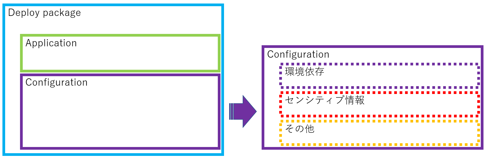
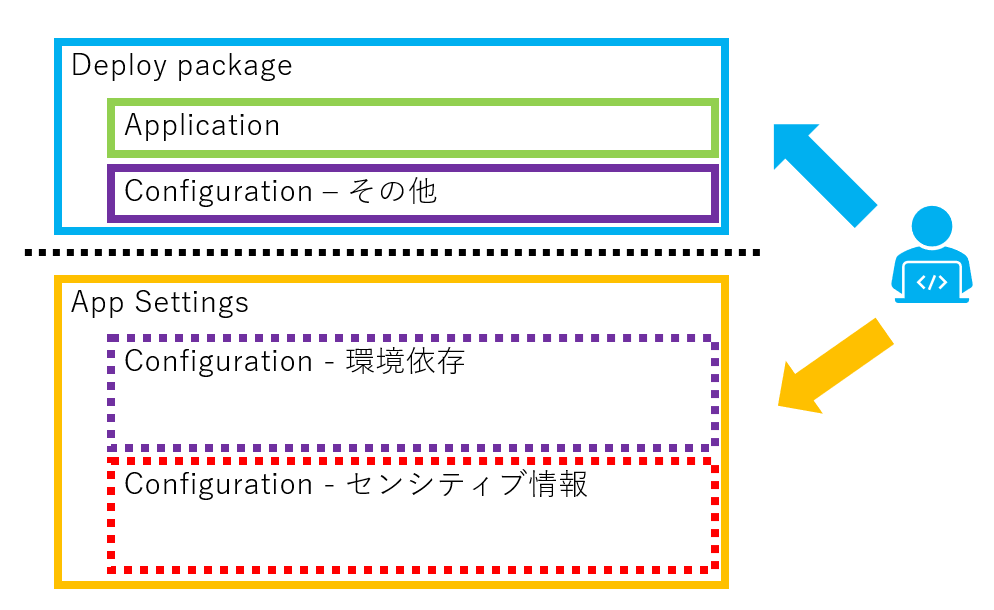
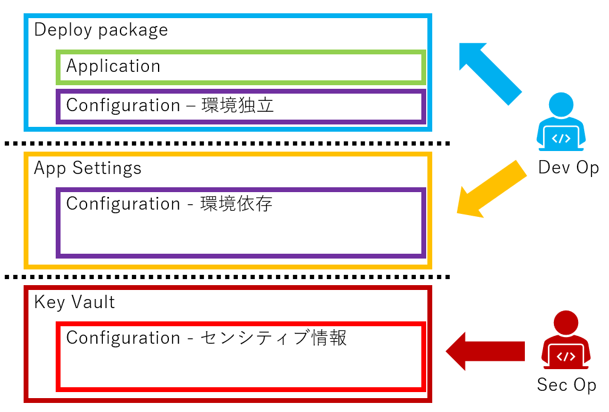
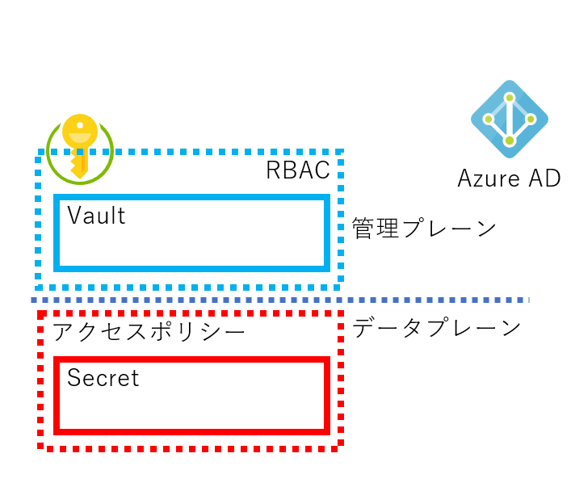
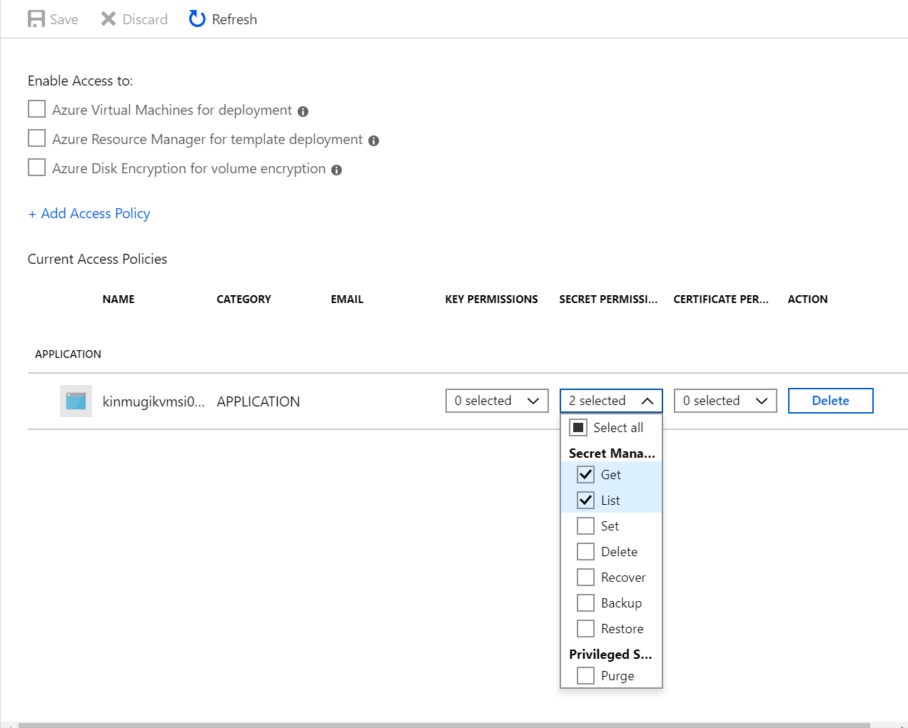
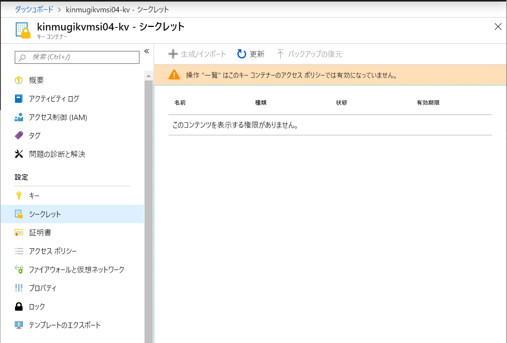
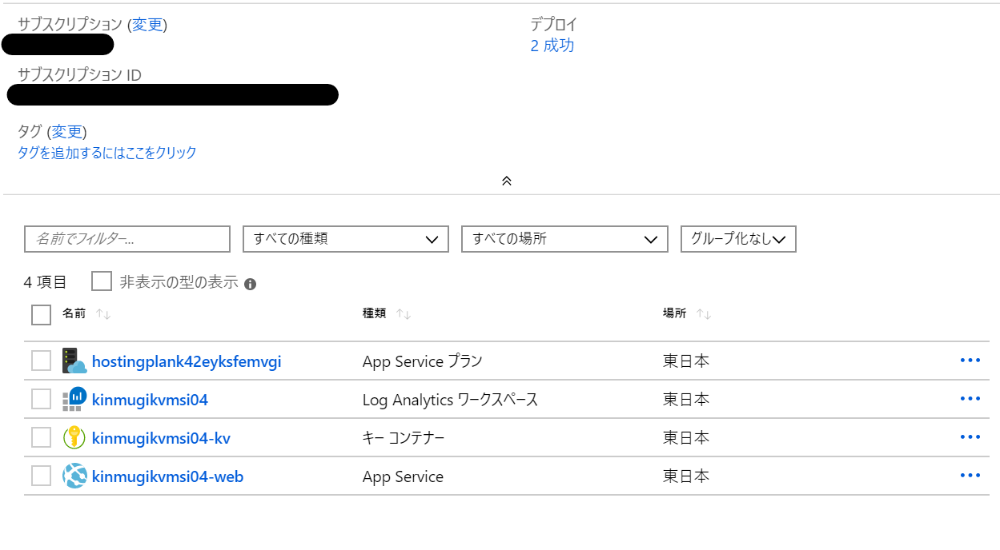
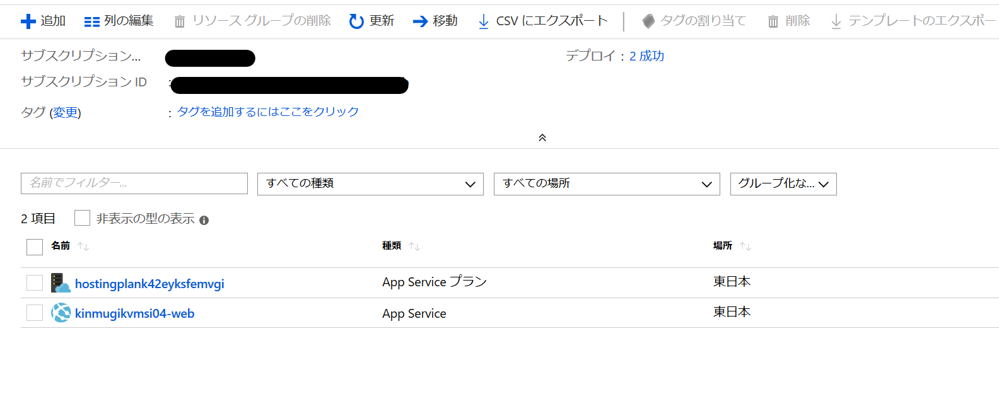
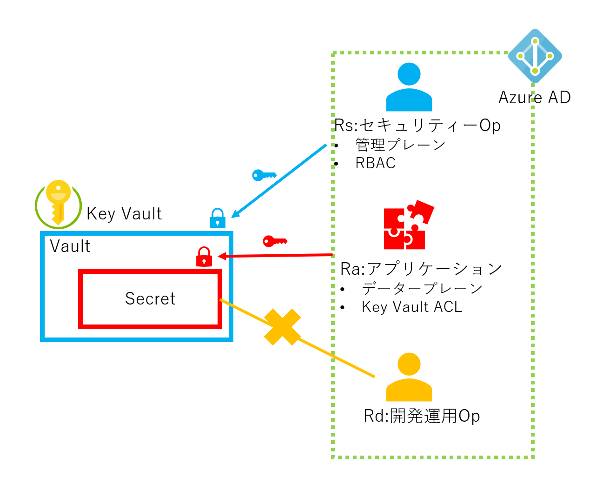

本稿は、こんな⼈に向けて書かれています。 

- Azure 上で App Service 等を使いアプリケーションを組んでいる
- セキュリティーと言うとRBAC が重要という認識ある
- Key Vault の存在は知っているけど使ってない
- クラウドでのセキュアアプリケーション構築に興味がある

## はじめに

インターネットサービスでは、その中にパスワード(SQL Database等)、アクセスキー（Storge、Redis等）など様々なセンシティブ情報(Sensitive Information)を保持しています。これらの、センシティブ情報を適切に管理することが重要です。これらの、センシティブ情報を [Azure Key Vault](https://azure.microsoft.com/en-in/services/key-vault/) に補完することで、安全に暗号化され状態で保存することができます。

セキュリティーを上げるために、下記のことを考慮すべきです。本稿では、以下の視点で説明していきます。

1. 分離：アプリケーションとセンシティブ情報は分離する
2. 暗号化：センシティブ情報は暗号化して保存する
3. アクセス管理：センシティブ情報のアクセスは制限する
4. 監査：センシティブ情報のアクセスを監査する

## 分離

今まで実装を振り返りながら、Key Vault と比較します。Key Vaultには、鍵、証明書、シークレット、ストレージアカウントを扱う機能がありますが、本稿ではシークレットを前提に話をしていきます。実装は、.NET Framework/Core 前提ですが、他の言語でも似たような機能があります。

### アプリケーションと設定ファイル(Configuration)の分離

以前より、環境依存設定（センシティブ情報含む）はソースファイルに直接記述せずに、外部の設定ファイルに記述し実行時に読み込むのが良いとされて来ました。例えば、データベースを使う場合のホスト名、データーベース名、Redis ホスト名等は、開発環境と本番環境で違います。これらの、環境依存の設定情報はハードコードせずに設定ファイルに記述します。（残念ながら、未だにソースコードにハードコードされてる場合があるようですが）

アプリケーションと設定ファイルで分離されていれば、デプロイの際に設定ファルを切り替えて、開発環境では「アプリケーション＋開発用の設定ファイル」、本番環境では「アプリケーション＋本番用の設定ファイル」とすれば、必要なものがデプロイできます。分離の利点は数多くありますが、大きな点を上げるなら、「環境毎にアプリケーション本体を修正する必要が無い、ソースコード管理からセンシティブ情報情報を除外できる、アプリケーションバイナリを解析してセンシティブ情報を抜き出される危険性が無い」などがあります。デプロイ後の設定ファイルはインスタンス内のインターネット非公開の場所に配置されます。

この方法の特徴でもあり問題でもある点は、アプリケーションと設定ファイルが纏めてデプロイされることです。そのため、デプロイ（パッケージの作成者）は、本番用の設定ファイルを参照することが可能で、同時にセンシティブ情報も参照することが可能です。（これを避けるためには、設定ファイルの一部を暗号化するなどの方法が取られます、後述）

この状態だとデプロイを自動化しても、CI/CDの設定をする時や、CI/CDでエラーになったときの調査でセンシティブ情報を見ることが出来てしまいます。CI/CDについては、参照、[Azure DevOps Projects を使用して既存のコードの CI/CD パイプラインを作成する](https://docs.microsoft.com/en-us/azure/devops-project/azure-devops-project-github)

<figure id="config01">

<figcaption>図１ アプリケーションと設定ファイルの関係</figcaption>
</figure>

設定ファイルの中には、アプリケーションを構成の補助情報、環境依存情報、センシティブ情報などが一体となって書かれているわけです。

.NET Frameworkの世界では、外部の設定ファイルとして、Web.config/App.config が、環境別設定生成ツールとして、XDT([How to use XDT in NuGet – Examples and Facts](https://devblogs.microsoft.com/nuget/how-to-use-nugets-xdt-feature-examples-and-facts/))が使われてきました。.NET Coreでは少し状況が変わって、ファイル、環境変数、Key Vaultなど複数のソースから動的に構成情報を構築できるようになっています。

### App Service の App Settings

より進んだ方法として、[Azure App Service](https://docs.microsoft.com/en-in/azure/app-service/overview)では、[App Settings](https://docs.microsoft.com/en-us/azure/app-service/configure-common) が用意されています。App Settingsでは、Azure Portal や、API経由 (例：[Web Apps - Get Configuration](https://docs.microsoft.com/en-us/rest/api/appservice/webapps/getconfiguration))で設定が行われ、設定内容はアプリケーション内から環境変数として参照できます。この仕組を使うと、アプリケーションのデプロイと設定を別々に行うことができるというのが大きな違いです。



こうすると、本番や開発などの別々のWeb Siteに「App Settingsに環境固有の設定をする」、「アプリケーションをデプロイする」の２つの手順に分けることで、設定とデプロイを別々にすることができます。また、App Settings の別の利点は、サービスが複数のインスタンスにスケールした時にも設定を一箇所で管理できるという点です。これは、従来のシステムで要件して重要視されることは（あまり）ありませんでしたが、クラウドの利点を活かすためには重要な要件です。このようにアプリケーションと設定を分離し共有する方法は、[External Configuration Store pattern](https://docs.microsoft.com/en-us/azure/architecture/patterns/external-configuration-store) として知られています。

App Settings のような方法は、「アプリケーション＋設定ファイル」で一つのパッケージとして扱うよりも格段に優れた方法（特にクラウド環境では）ですが、セキュリティーという面では、設定にセンシティブなものとそうでないものの区別が無く、設定のどこ項目を誰が見れるかなどの設定ができないという点で不十分です。この区別が無いために、設定を確認できる人＝センシティブ情報にアクセス出来る人となってしまいます。セキュリティー面から言うと、センシティブ情報にアクセスできる人は少ないほど良い（運用難易度が低い）と言えるので、この点は良くありません。

リソース操作に、「Microsoft.Web/sites/config」に、「Read, Write, delete, snapshots/read, list/Action」が有ありますが、これを許可しない(NotAction)場合、App Settings 全体の操作に影響します。これだと少々粒度が荒く使い辛い。つまり、App Services と App Settingsの組み合わせだけでは、環境依存設定とセンシティブ情報の分離が不十分である。

※ その他の、RBACで設定可能な、App Settingsの操作は、[Microsoft.Web/sites/config/*](https://docs.microsoft.com/en-us/azure/role-based-access-control/resource-provider-operations#microsoftweb) を見てください。

更に、App Settingsの内容は、同一のWeb Site内でしか共有出来ないので、複数のWeb Siteから構成されたサービスでは設定の共有という利点を享受することができない。この点に関しては、[Azure App Configuration ](https://docs.microsoft.com/en-us/azure/azure-app-configuration/) に期待しています。これは来るまでは、Azure Storage Blobに設定ファイルを置くなどの方法を取るのが現実的です。ここに、[External Configuration Store Pattern](https://github.com/mspnp/cloud-design-patterns/tree/master/external-configuration-store) のサンプルコードがありますが、.NET Framework用ですし少々古いので要注意です。

{}
**センシティブ情報にアクセスできる人は少ないほど良い**

例えば、PCI DSS 3.2.1 要件 3.6.5 に下記のようにあります。

{}
> 「平文暗号化鍵の知識を持つ従業員が離職したなど、」鍵の整合性が脆弱になっている場合、または鍵が侵害された疑いがある場合に必要な、鍵の破棄または取り替えを。

{}

ここでは、平文暗号化鍵と記述されていますが、センシティブ情報に全般に該当すると考えて良いでしょう。センシティブ情報にアクセスできる人が少なければ少ないほど、現実的な運用が可能となりセキュリティーリスクが軽減されると言えます。

{}

### Azure Key Vault を使う

センシティブ情報の保存に、Key Vault を利用します。下図のようにすると、アプリケーションの開発運用担当と、センシティブ情報を扱うセキュリティー担当を完全にわけることがでます。これは、App Service + App Settingsだけでは出来なかったことで、センシティブ情報を知る範囲を狭めるという意味で非常に効果的です。言い方を変えると、アプリケーションの開発運用チームはセンシティブ情報を扱わなくなり、チームに要求されるセキュリティー上の負担を軽減されます。これが、センシティブ情報情報の局所化によってもたらされる利点です。



アプリケーションから Key Vault へのアクセスは、設定情報に、専用のService Principalを用意して自前でアクセス経路を用意するか、**Azure リソースのマネージド ID** ([Azure リソースのマネージド ID とは?](https://docs.microsoft.com/ja-jp/azure/active-directory/managed-identities-azure-resources/overview), 以下MSI)を使います。App Service では、MSIを使うのがベストプラクティスです。だたし、現時点では、すべてのAzure リソースがMSIに対応しているわけではないので注意が必要です。[Services that support managed identities for Azure resources](https://docs.microsoft.com/en-us/azure/active-directory/managed-identities-azure-resources/services-support-managed-identities)
MSI 非対応リソースでは、リーソースとKey Vaultの紐付をして上げる必要があります。（これに付いては別途）

### MSIを使ったKey Vaultへのアクセス

簡単に、**Azure リソースのマネージド ID (MSI)**  を使った、App SericesからのKeyVaultの利用を説明します。細部を省略して言うと、MSIは、Azureのリソースに専用のAzure ADのサービスプリンシパルを作成する機能です。リソースに紐付いたサービスプリンシパルが作成され、他のリソースでは、そのサービスプリンシパルからのアクセスを許可します。アプリケーションからは、自身のリソースに紐付いたサービスプリンシパルのトークンを取得でき、それを使って、許可されたリソースを呼ぶことができます。MSI以前では、Azure ADあるいは、リソースへのアクセスは、パスワードやアカウントキーで制御されていました。MSIはAzure AD認証を使うリソースへのアクセスを簡易化する仕組みです。MSIには、システム割当のマネージドIDとユーザー割当のマネージドIDがありますが、ここではシステム割当のマネージドIDで説明します。（ユーザー割当の方は、Key Vault 側がサポートしていません）

Azure Portal、Azure CLI、PowerShell、ARM template などいろいろな方法で設定できますか。再現性が高いので、ここでは、ARM template を使って説明します。利用方法の詳細は、[App Service と Azure Functions でマネージド ID を使用する方法](https://docs.microsoft.com/ja-jp/azure/app-service/overview-managed-identity) 

この辺から、実際の構築コードを交えながら説明します。サンプルコード一式は、[ここ](https://github.com/takekazuomi/keyvault-msi-sample) にあります。

Web Appsの作成時に、identity プロパティに、**type": "SystemAssigned"** を指定すると、このリソースにシステム割当のマネージドIDが作成されます。

```json
{
    "type": "Microsoft.Web/sites",
    "apiVersion": "2016-08-01",
    "name": "[parameters('webSiteName')]",
    "location": "[resourceGroup().location]",
    "identity": {
        "type": "SystemAssigned"
    },
    "dependsOn": [
        "[variables('hostingPlanName')]"
    ],
    "tags": {
        "usage": "kvmsi"
    },
    "properties": {
        "name": "[parameters('webSiteName')]",
        "serverFarmId": "[resourceId('Microsoft.Web/serverfarms', variables('hostingPlanName'))]",
        "siteConfig": {
            "appSettings": [
                {
                    "name": "KeyVaultUrl",
                    "value": "[concat('https://', parameters('keyVaultName'), '.vault.azure.net/')]"
                }
            ]
        }
    }
},
```

ここで、**appSettings** に、KeyVaultUrl という名前で、keyvaultのurlをセットしています。アプリケーションは、このApp Settingsの値とマネージドIDを使って、Key Vaultにアクセスします。マネージドIDのハンドリングは、.NET Core だと、ライブラリ（AzureServiceTokenProvider）がやってくれるんで、アプリケーション側で配慮する必要があるのは、Key VaultのURLだけです。ライブラリ内の実装がどうなっているのかは、[このあたり](https://github.com/Azure/azure-sdk-for-net/blob/master/sdk/mgmtcommon/AppAuthentication/Azure.Services.AppAuthentication/TokenProviders/MsiAccessTokenProvider.cs#L66)を見ると分かります。

次に、Key Vaultのリソースを作成し、上記のシステム割当のマネージドIDへのアクセス権を与えます。**accessPolicies** のプロパティの部分がアクセス権を与えている部分です。

```
{
    "type": "Microsoft.KeyVault/vaults",
    "name": "[parameters('keyVaultName')]",
    "apiVersion": "2016-10-01",
    "location": "[resourceGroup().location]",
    "tags": {
        "usage": "kvmsi"
    },
    "properties": {
        "sku": {
            "family": "A",
            "name": "Standard"
        },
        "tenantId": "[reference(variables('identityResourceId'), '2015-08-31-PREVIEW').tenantId]",
        "accessPolicies": [
            {
                "tenantId": "[reference(variables('identityResourceId'), '2015-08-31-PREVIEW').tenantId]",
                "objectId": "[reference(variables('identityResourceId'), '2015-08-31-PREVIEW').principalId]",
                "permissions": {
                    "secrets": [
                        "get",
                        "list"
                    ]
                }
            }
        ]
    },
    "dependsOn": [
        "[concat('Microsoft.Web/sites/', parameters('webSiteName'))]"
    ]
},
```

**identityResourceId** は、variableして下記のように宣言されています。

```json
 "identityResourceId": "[concat(resourceId('Microsoft.Web/sites', parameters('webSiteName')),'/providers/Microsoft.ManagedIdentity/Identities/default')]",
```

**accessPolicies** の、tenantId と objectId の設定は、reference を取得して属性を引いています。 を実行するためには、実態が作成されている必要があるので、dependsOnでwebSiteに依存させています。リソースに依存関係がある場合は、依存関係を解決する順番でリソースが作成されていきます。依存関係を記述しないと、順番が保証されないため、デプロイ時に成功したり失敗したりする不安定な結果になります。

**permissions": "secrets"** に、get, list を付けています。**accessPolicies** に列挙された操作だけが許されます。ここで、listを許可しているのは、今回使った .NET Coreのライブラリが列挙操作をするためです、読むだけならば、get 操作だけで良いはずなのですが、残念です。今回も、listを付けずにハマりました。[このあたり](https://github.com/aspnet/Extensions/blob/master/src/Configuration/Config.AzureKeyVault/src/AzureKeyVaultConfigurationProvider.cs#L77)で、リストしているのが原因です。

このテンプレートでは、追加でシークレットを作成しています。本番の展開で使えるかどうかは課題ですが、リソースの作成時にシークレットを作成しパラメータでもらった値を中に入れています。そうすると、その後書き込み権限を誰も持っていない状態にできます。少し魅力的ではありますが、シークレットのローテーションなどを考えるとあまり実用的では無いかもしれません。

```json
{
    "type": "Microsoft.KeyVault/vaults/secrets",
    "name": "[concat(parameters('keyVaultName'), '/', 'secret')]",
    "apiVersion": "2016-10-01",
    "properties": {
        "value": "[parameters('keyVaultSecret')]"
    },
    "dependsOn": [
        "[concat('Microsoft.KeyVault/vaults/', parameters('keyVaultName'))]"
    ]
}
```

### アプリケーションからの利用

一旦リソースが出来てしまえば、アプリケーションからの利用は簡単です。.NET Coreでは構成設定のライブラリ(Microsoft.Extensions.Configuration)が対応しているので、定形コードを入れるだけで設定をKey Vaultから読み込みようになります。本稿では、アプリケーションの外側に設定情報を保持し、用途によって分離する利点を付いて語っていますが、コードから見ると分散してしまっているのは面倒という側面もあります。.NET Core (Microsoft.Extensions.Configuration)では、複数のソースからの設定情報をマージして１つのConfiguration（IConfigurationRoot)に纏める機能があります。これを使うと、Jsonファイルから読んだものと、App Settingsからのもの(＝環境変数経由)をマージしたり、開発時はセンシティブ情報をUserSecretsから読み、本番ではKey Vaultから読むなどの構成を取れます。設定情報の分離により複雑さの増加を、ライブラリが吸収してくれるというわけです。

では実際のコードを見てみましょう。ConfigureAppConfigurationを呼んで、Key Vaultから設定情報を読むように WebHostBuilder に構成を追加します。CreateDefaultBuilder の中の処理で環境変数から設定情報を取り込んでいるので、WebAppsのリソースを作成する時に、App Settingsに設定した、**KeyVaultUrl** にKey VaultのURLが、builtConfigに入っています。このURL、keyVaultClient、SecretManagerを AddAzureKeyVault 拡張メソッドに渡します。やることは、これだけです。Key Vault の呼び出しはキャッシュされるという点には注意が必要です。

```C#
public class Program
{
    public static void Main(string[] args)
    {
        CreateWebHostBuilder(args).Build().Run();
    }

    public static IWebHostBuilder CreateWebHostBuilder(string[] args) =>
        WebHost.CreateDefaultBuilder(args)
            .ConfigureAppConfiguration((context, config) =>
            {
                if (context.HostingEnvironment.IsProduction())
                {
                    var builtConfig = config.Build();

                    var azureServiceTokenProvider = new AzureServiceTokenProvider();
                    var keyVaultClient = new KeyVaultClient(
                        new KeyVaultClient.AuthenticationCallback(
                            azureServiceTokenProvider.KeyVaultTokenCallback));

                    config.AddAzureKeyVault(builtConfig["KeyVaultUrl"],
                        keyVaultClient,
                        new DefaultKeyVaultSecretManager());
                }
            })
            .UseStartup<Startup>();
}
```

Microsoft.Extensions.Configuration 自体は、.Net Standard 2.0なので、.NET Framework でも使えるのですが、従来の [System.Configuration](https://docs.microsoft.com/en-us/dotnet/api/system.configuration?view=netframework-4.8) との共存など考えると、現状ではあまり使いやすいものではありません。.NET Frameworkでは、4.7.1 で追加された、[Microsoft.Configuration.ConfigurationBuilders](https://docs.microsoft.com/ja-jp/aspnet/config-builder) の利用をお勧めします。この２つは、名前がややっこしいので混乱します。ここでは、.NET Core 2.2 の例になっています。 ConfigurationBuildersのソースは、[ここ](https://github.com/aspnet/MicrosoftConfigurationBuilders)にあります。今は、V2を鋭意作成中のようです。

## アクセス管理

Key Vault を安全性を高めるにはアクセスマネージメントを理解する必要がある。これが理解出来てないと、大きな穴があっても気が付かないということに成りかねない。

アクセスモデルとして重要なのは下記の２点、

- 管理プレーンとデータプレーンの２層に分かれている
- アクセスマネージメントは、Azure AD の Security Principal をベースに行われる

重要な点は上記２点しか無い、そのうち１つは、アクセスは 2 つのプレーン、管理プレーン(management plane)とデータ プレーン(data plane)で管理されることだ。そして、どちらのプレーンでも、認証にはAzure ADが使われる。



"管理プレーン" では コンテナーの作成と削除、アクセス ポリシーなど、Key Vault そのものを管理し、"データ プレーン" では、アクセス ポリシーに基づいて、どのプリンシパルが、キー コンテナーに格納されているデータを操作できるかを管理する。管理プレーンにアクセス権が無いと、コンテナの操作はできず、データプレーンにアクセス権が無いと（アクセス ポリシーで許可されていないと）データにはアクセスできない。データプレーンのアクセスポリシーを変更は、管理プレーンの権限で、アクセスポリシーの変更権とデータへのアクセス権とが別れているところが味噌になっている。

前記のARM template で作成した結果がどうなってるのかを Azure Portal で確認してみよう。まず アクセスポリシーを見る、



ここは、ARM template で下記の用に記述していたところです。記述通りに、作成したWeb Apps だけが一覧に出てきて、シークレットのgetとlistにチェックが入っています。

```
"accessPolicies": [
    {
        "tenantId": "[reference(variables('identityResourceId'), '2015-08-31-PREVIEW').tenantId]",
        "objectId": "[reference(variables('identityResourceId'), '2015-08-31-PREVIEW').principalId]",
        "permissions": {
            "secrets": [
                "get",
                "list"
            ]
        }
    }
]
```

Portalでシークレットの設定を見てみましょう、Portal にログインしているユーザーは、先程のaccessPoliciesのリストに載ってない別のユーザーで、アクセスは許可されていません。その場合、下記のような表示になります。



しかし、残念ながら、このポータルにアクセスしているユーザーは、Key Vaultのアクセスポリシーを操作することができるので、アクセスポリシーを変更してデータプレーンへアクセスが出来るようにすることが出来てしまいます。「	
Web サイト共同作成者（Web Contributer）」などのロールでは、Key Vaultへのアクセスが許可されていないので、そのような操作をすることは出来ません。

共同作成者とWeb サイト共同作成者の2つを並べて見ると、こんな感じになります。

共同作成者では、App Service プラン、App Servce、Log Analytics ワークスペース、キー コンテナーの４つのリソースが見えます。



それに対して、Web サイト共同作成者では、App Service プラン と App Servce の２つだけです。



これを見ると、Web サイト共同作成者は、完全に Key Vault が見えなくなっているのがわかります。これを見てわかるように、RBACのロール周りは少々わかり辛いですが、セキュリティー面では非常に強力な武器になります。これだと、Log Analyticsも見えなくってしまっているので、もう少し権限をたしてやらないといけませんが。

これらの機能を使うと、ロール分けを考えてみましょう。ロール分けの参考にしてみてください。

1. Rs:セキュリティーOp（センシティブ情報にふれることが出来る）
2. Rd:開発運用者（デプロイ、ログ、メトリックス、構成情報へアクセス）
3. Ra:アプリケーション



暗号化と監査の話も書きたいのですが、長くなったので。今回は、このへんにして、まとめに入ります。

## まとめ

センシティブ情報は分離して、Key Vault に入れましょう。昔のように、Configの一部を暗号化したり、
[Encrypting Configuration File Sections Using Protected Configuration](https://docs.microsoft.com/en-us/dotnet/framework/data/adonet/connection-strings-and-configuration-files#encrypting-configuration-file-sections-using-protected-configuration) 、App Setting に入れるだけの方法より過ぐれていて、導入もそれほど難しくはありません。

導入で少し敷居が高いところがあるとすると、アクセス管理の部分だけと思いますが、それもそれほど難しいわけではありません。

少しのコストで大きな効果、Key Vault はとても良いものです。Let's Key Vault.

